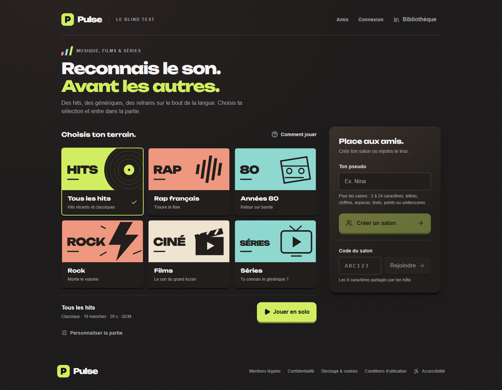

# Pulse — blind test multijoueur

Un jeu musical en temps réel, en solo ou entre amis, avec des playlists personnelles et des invitations. Projet personnel de **Toan TRUONG**, développé en TypeScript avec React, Express et PostgreSQL.

[Architecture](docs/architecture.md) · [Installation](#lancer-le-projet) · [Tests](docs/validation.md) · [Guide utilisateur](docs/guide.md)



[Version mobile](docs/screenshots/home-mobile.png) · [Une partie](docs/screenshots/game-mobile.png) · [Bibliothèque](docs/screenshots/playlist.png)

Les captures viennent de l’application, avec des données de test fictives. La refonte est testée localement ; sa mise en ligne et l’activation des comptes Supabase réels restent à finaliser. Les captures et les tests sont donc les références de cette version, pas une promesse de disponibilité du site public.

## Fonctionnalités

- **Parties solo et salons jusqu’à 24 joueurs** : code, lien ou QR d’invitation, réglages de l’hôte, reconnexion, scores calculés côté serveur.
- **Musique, films et séries** : QCM ou saisie libre, modes classique et progressif, sources publiques Deezer ou playlists personnelles. TMDB est facultatif et réservé au cinéma.
- **Sélection musicale** : 13 sélections éditoriales, plans figés, déduplication des enregistrements, espacement des artistes et préférence pour les titres non récemment joués.
- **Bibliothèques** : sauvegarde depuis les résultats, playlists privées, partage par lien, catalogue public, copie indépendante.
- **Comptes facultatifs et amis** : import d’une bibliothèque invitée, demandes d’amis, invitations à rejoindre un salon. Nécessite Supabase Auth ; le mode invité fonctionne sans compte.
- **Interface responsive** : navigation clavier, texte agrandi, réduction des animations, états de chargement et erreurs récupérables. PWA installable, mais jeu connecté.

## Ce que ce projet met en pratique

| Sujet               | Mise en œuvre                                                                                           |
| ------------------- | ------------------------------------------------------------------------------------------------------- |
| Temps réel          | Serveur autoritaire, phases de jeu, deadlines, jetons de reconnexion distincts des IDs publics          |
| Données et sécurité | Validation Zod, migrations Prisma, RLS, séparation des bibliothèques, contrôle d’identité côté serveur  |
| APIs externes       | Délais bornés, caches limités, regroupement des requêtes et validation des médias                       |
| Qualité             | Tests métier, HTTP et Socket.IO ; parcours Playwright avec PostgreSQL réel ; contrôles axe-core         |
| Produit             | Parcours sans compte, consentement au partage, récupération après erreur et identité visuelle cohérente |

**Stack :** React 18 · TypeScript · Vite · Tailwind CSS · Howler · Express · Socket.IO · Prisma · PostgreSQL · Supabase Auth.

## Lancer le projet

Prérequis : **Node 24** (voir [.nvmrc](.nvmrc)), npm, PostgreSQL. Node 22.12+ est également ciblé par la CI. Docker est facultatif.

1. Copier [backend/.env.example](backend/.env.example) vers `backend/.env`. Les valeurs proposées ciblent PostgreSQL local ; ne pas les utiliser comme identifiants de production.
2. Démarrer PostgreSQL avec `docker compose up -d`, ou adapter les deux URLs de base à votre installation.
3. Depuis la racine :

```sh
npm ci
npm --prefix backend ci
npm --prefix frontend ci
npm run db:migrate
npm run db:check
npm run dev
```

Ouvrir **http://localhost:5173**. Le serveur écoute sur **3001** ; Vite relaie les appels HTTP et Socket.IO. Les migrations sont versionnées et ne réinitialisent pas la base.

La musique nécessite un accès à Deezer. Pour les films/séries, renseigner `TMDB_API_KEY` côté backend. Pour les comptes, suivre [la configuration Supabase Auth](docs/ACCOUNTS-BACKEND.md). Aucun secret n’est requis pour exécuter les tests unitaires.

**Alternative entièrement conteneurisée :** `docker compose -f compose.app.yaml up --build`, puis http://localhost:8080. Cette configuration de développement démarre PostgreSQL, les migrations, l’API et Nginx ; les comptes Auth ne sont pas configurés par défaut.

## Organisation

```text
backend/
  src/
    app.ts          Configuration HTTP testable, sans ouverture de port
    index.ts        Démarrage HTTP/Socket.IO et arrêt du processus
    domain/         Règles du jeu, correction et sélection musicale
    routes/         Contrats HTTP et validation des entrées
    services/       Cas d’usage, données et fournisseurs externes
    sockets/        Cycle de vie des salons et événements temps réel
  prisma/           Modèle et migrations versionnées
frontend/
  src/
    pages/          Écrans routés
    features/       État et interactions par fonctionnalité
    components/     Affichage et éléments partagés
    services/       HTTP, Auth, stockage et presse-papiers
  e2e/              Parcours complets sur une base locale isolée
docs/               Architecture, tests, utilisation et exploitation
```

Les [décisions d’architecture](docs/architecture.md) détaillent les compromis : état de salon en mémoire, API comme frontière de confiance, comptes facultatifs et gestion des dépendances externes.

## Vérifier le projet

```sh
npm run format:check
npm run check
```

`check` exécute lint, typage, tests et builds. Le workflow [GitHub Actions](.github/workflows/ci.yml) ajoute des vérifications sur Node 22/24 et les tests navigateur avec PostgreSQL temporaire, sans secrets de production. Il ne déploie pas l’application.

Voir [les commandes E2E, les résultats et leurs limites](docs/validation.md). Les tests ne constituent pas une certification d’accessibilité ou de sécurité.

## Limites et prochaines étapes

- Les salons vivent dans **un seul processus** et disparaissent au redémarrage. Le multiserveur et le classement persistant ne sont pas implémentés.
- Un code de bibliothèque invitée est une clé d’accès confidentielle, pas une identité. Les comptes ajoutent une véritable vérification de session.
- Les extraits dépendent des fournisseurs ; l’audio mobile réel, les e-mails Auth et la charge de production restent à valider.
- Finaliser les variables Auth et la publication Render/Vercel avant de présenter une démonstration publique comme opérationnelle.

[Déploiement](docs/deploiement.md) · [API](docs/api.md) · [Contribuer](CONTRIBUTING.md) · [Sécurité](SECURITY.md)

Contact : [truong_toan@hotmail.com](mailto:truong_toan@hotmail.com).
